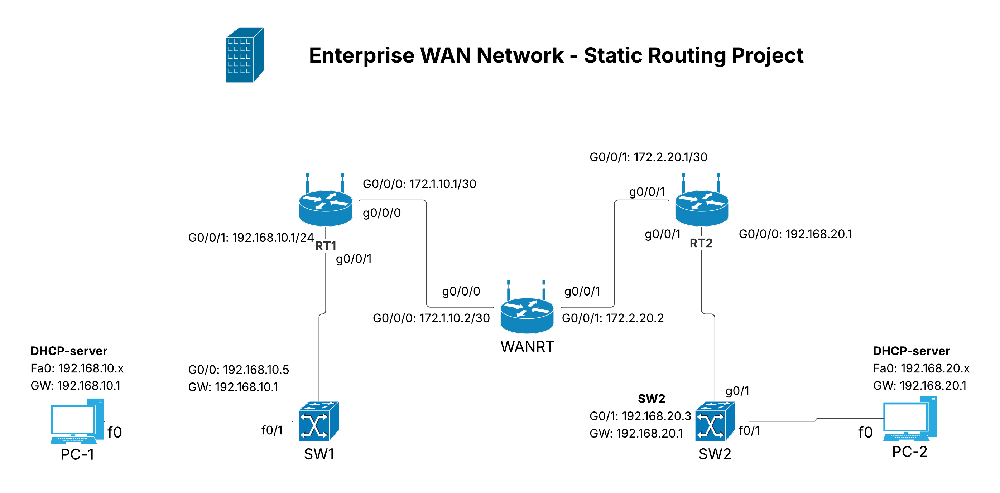

# Enterprise WAN Network - Static Routing Lab

## Overview
This project demonstrates a simple **enterprise WAN topology** built in Cisco Packet Tracer using **static routing**.

Two local networks (LANs) are connected through a central WAN router, allowing full end-to-end communication between hosts.

In addition to routing, this lab also implements:
- DHCP for automatic IP assignment
- Switch port security
- Secure remote access using SSH

---

## Topology



---

##  Network Architecture

The network consists of three routers:

- **RT1** → LAN 1
- **WANRT** → Core/WAN router
- **RT2** → LAN 2

Each LAN is connected through a switch and communicates over point-to-point WAN links.

---

##  IP Addressing

### LAN Networks

| Network           | Gateway         | Description |
|------------------|-----------------|------------|
| 192.168.10.0/24  | 192.168.10.1    | LAN 1      |
| 192.168.20.0/24  | 192.168.20.1    | LAN 2      |

---

### WAN Links

| Connection        | Network         | IP Addresses                 |
|------------------|-----------------|------------------------------|
| RT1 ↔ WANRT      | 172.1.10.0/30   | 172.1.10.1 ↔ 172.1.10.2      |
| WANRT ↔ RT2      | 172.2.20.0/30   | 172.2.20.2 ↔ 172.2.20.1      |

---

### Device Interfaces

| Device | Interface | IP Address        |
|--------|----------|-------------------|
| RT1    | G0/0/0   | 172.1.10.1/30     |
| RT1    | G0/0/1   | 192.168.10.1/24   |
| WANRT  | G0/0/0   | 172.1.10.2/30     |
| WANRT  | G0/0/1   | 172.2.20.2/30     |
| RT2    | G0/0/0   | 172.2.20.1/30     |
| RT2    | G0/0/1   | 192.168.20.1/24   |

---

## Lab Access Credentials

The following credentials are used for accessing the devices in the lab.

| Access      | Username |      Password      |
|-------------|----------|--------------------|
|  SSH	      |  admin  |  StrongPassword123 |
| Console     |    -     |     Cisco          |
| Enable Mode |    -     |     Class          |

Example SSH login:

ssh -l admin 192.168.10.4

These credentials are used only for demonstration purposes.


## Static Routing Configuration

### RT1
```bash
ip route 192.168.20.0 255.255.255.0 172.1.10.2
ip route 172.2.20.0 255.255.255.252 172.1.10.2
```

### WANRT
```bash
ip route 192.168.10.0 255.255.255.0 172.1.10.1
ip route 192.168.20.0 255.255.255.0 172.2.20.1
```

### RT2
```bash
ip route 192.168.10.0 255.255.255.0 172.2.20.2
ip route 172.1.10.0 255.255.255.252 172.2.20.2
```

---

## DHCP Configuration

- RT1 provides DHCP for **192.168.10.0/24**
- RT2 provides DHCP for **192.168.20.0/24**

Clients automatically receive:
- IP address
- Default gateway
- DNS server


## Verification

- PC1 → PC2 communication 
- PC1 → 172.2.20.1 
- End-to-end connectivity 

Example:

```bash
ping 192.168.20.10
```

---

## How It Works

1. PC1 sends traffic to RT1 (default gateway)
2. RT1 forwards traffic to WAN router
3. WAN router forwards traffic to RT2
4. RT2 delivers traffic to LAN 2

---

## Key Concepts Learned

- Static routing requires manual configuration
- Each route must have a return path
- WAN links commonly use /30 subnetting
- DHCP automates IP assignment
- Port security enhances Layer 2 security
- SSH secures remote access

---

## Limitations

- Not scalable
- Manual configuration required
- No automatic failover

---

## Future Improvements

- Implement OSPF (dynamic routing)
- Improve scalability and automation

---

## Device Configurations

All device configurations are included in the `configs/` directory:

| Device | File |
|--------|------|
| RT1 | configs/RT1.txt |
| WANRT | configs/WANRT.txt |
| RT2 | configs/RT2.txt |
| SW1 | configs/SW1.txt |
| SW2 | configs/SW2.txt |

These files contain the full running configuration for each device.

## Tools Used

- Cisco Packet Tracer
- IPv4 Networking
- Static Routing
- DHCP
- SSH
- Switch Port Security